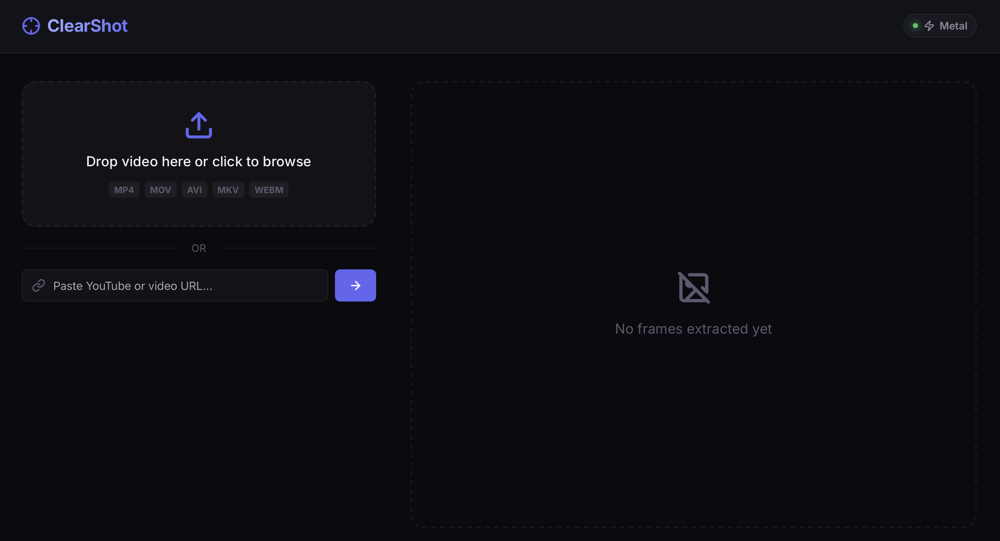
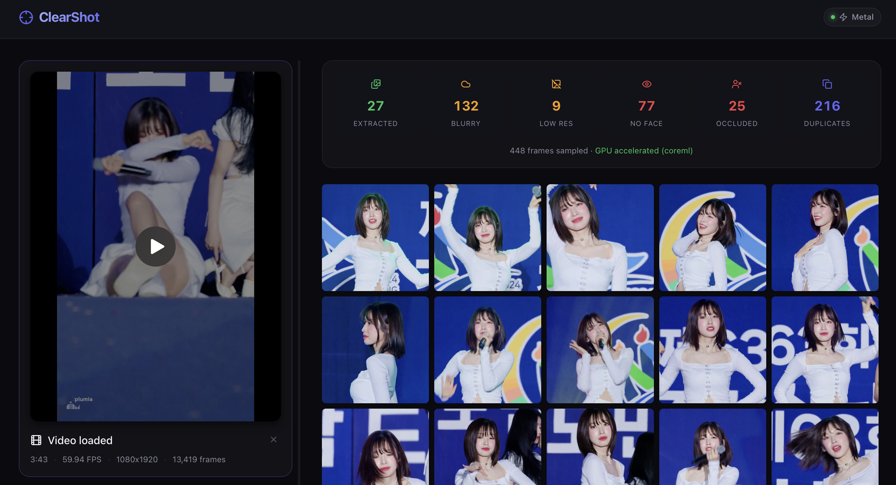
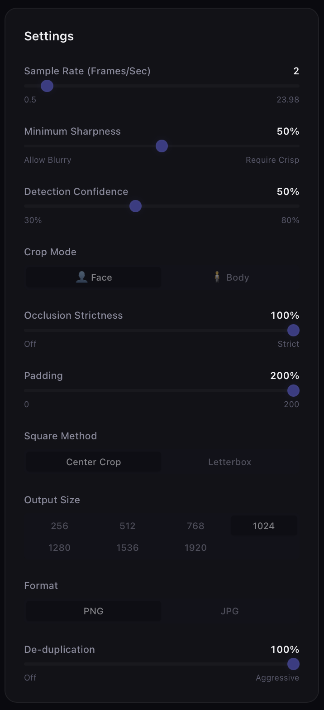

# ClearShot — Training Data Extractor

Extract sharp, face-focused frames from local videos or YouTube URLs for AI/ML training data. 

ClearShot is a full-stack application with a React frontend and a FastAPI backend. It utilizes ONNX Runtime to provide high-performance hardware-accelerated face and pose detection (including Metal GPU support for Apple Silicon).

## Features

- **Local & Online Videos** — Upload a local `.mp4`/`.mov` or paste a YouTube URL to automatically download and process.
- **Smart Frame Sampling** — Configurable FPS extraction rate.
- **Blur Rejection** — Laplacian variance filter removes motion-blurred frames.
- **Hardware-Accelerated AI** — Uses ONNX Runtime for blazing-fast inference:
  - **Face Mode**: Uses SCRFD 2.5G.
  - **Body Mode**: Uses YOLOv8n-pose.
  - *Full support for Apple Silicon CoreML (Metal GPU) and CUDA.*
- **Square Output** — Center-crop or letterbox to square, at configurable resolutions (up to 1920px).
- **De-duplication** — Perceptual hashing skips near-identical frames.
- **Batch Download** — Export all extracted frames as a ZIP archive.

## Screenshots

<div align="center">
  
  <p><i>Easily upload a local video or drop a YouTube link to begin processing.</i></p>
  <br/>

  
  <p><i>Review, filter, and extract AI-ready training frames in the gallery view. (Featuring K-pop idol Arin from <a href="https://www.youtube.com/watch?v=GZEInkKcVCk">this video</a>)</i></p>
  <br/>

  
  <p><i>Fine-tune your extraction with powerful options like blur rejection, confidence thresholding, and padding.</i></p>
</div>

## Requirements

- **Node.js 18+** (for frontend)
- **Python 3.10+** (for backend)
- **FFmpeg** (Must be installed and available in `$PATH`)

### Install FFmpeg

**macOS:**
```bash
brew install ffmpeg
```

**Windows:**
```bash
winget install ffmpeg
# or
choco install ffmpeg
```

**Linux:**
```bash
sudo apt install ffmpeg
```

## Setup & Running

We provide automated scripts to make installation and startup easy. 
Make sure you have **Python 3.10+** and **Node.js 18+** installed before running these.

### Quick Start

```bash
# 1. Install all Python and Node dependencies
./install.sh

# 2. Start the FastAPI backend and React frontend
./start.sh
```

The app will be available at **http://localhost:5173**.

---

### Manual Setup (Optional)

#### 1. Backend Setup

```bash
# Clone / navigate to the project
cd clear-shot

# Create virtual environment (recommended)
python3 -m venv venv
source venv/bin/activate

# Install dependencies
pip install -r requirements.txt

# Start the FastAPI server (runs on port 8000)
python3 server.py
# Or using uvicorn: uvicorn server:app --host 0.0.0.0 --port 8000
```

### 2. Frontend Setup

In a new terminal window:

```bash
cd clear-shot/frontend

# Install dependencies
npm install

# Start the Vite development server
npm run dev
```

The app will be available at **http://localhost:5173**.

### 3. Production Build

To run the app as a single service, build the frontend first. The FastAPI backend is configured to automatically serve the compiled React app.

```bash
cd clear-shot/frontend
npm run build
cd ..

# Start the backend; it will serve the frontend on http://localhost:8000
python3 server.py
```

## Developer Guide & Architecture

For a complete breakdown of the application architecture, GPU optimization details, API endpoints, and instructions on how to rebuild this app from scratch, please read **[ARCHITECTURE.md](./ARCHITECTURE.md)**.

## Acknowledgments & Credits

ClearShot is built on the shoulders of giants. We would like to credit the authors and maintainers of the following open-source projects, models, and repositories that make this application possible:

### YouTube Extractor Repositories
- **[yt-dlp](https://github.com/yt-dlp/yt-dlp)** & **[youtube-dl](https://github.com/ytdl-org/youtube-dl)** — The legendary YouTube downloader repositories and source of inspiration for video extraction tools.

### AI & Machine Learning Models
- **[SCRFD (InsightFace)](https://github.com/deepinsight/insightface)** — The blazing-fast face detection model. Authored by Jia Guo, Jiankang Deng, and the InsightFace team.
- **[YOLOv8-pose ONNX Port](https://huggingface.co/Xenova/yolov8n-pose)** — ONNX export of YOLOv8-pose used in this project. Ported by Joshua Lochner (Xenova).

### Utility Libraries
- **[pytubefix](https://github.com/JuanBindez/pytubefix)** — Used for YouTube video probing and downloading. Authored by Juan Bindez.
- **[ImageHash](https://github.com/JohannesBuchner/imagehash)** — Used for perceptual hashing and deduplication. Authored by Johannes Buchner.

### Design
- **UI/UX** — Designed with AI UI/UX Pro Max skills by the user.

## License

ClearShot is licensed under the **MIT License**. See [LICENSE.md](./LICENSE.md) for the full license text.

## Settings Guide

| Setting | Default | Description |
|---------|---------|-------------|
| Extraction FPS | 2.0 | Frames sampled per second of video. |
| Blur Threshold | 100 | Higher = stricter blur rejection. |
| Detection Confidence | 0.5 | Minimum AI detection score (face/body). |
| Crop Mode | Face | Face-focused or full body. |
| Padding % | 20% | Extra margin around the detected region. |
| Square Method | Center Crop | Center-crop (fill) or letterbox (fit). |
| Output Size | 512px | Final image dimension. |
| Output Format | PNG | PNG (lossless) or JPG. |
| De-dup Sensitivity | 8 | 0 = off, higher = more aggressive perceptual deduplication. |
| Occlusion Strictness | 50 | 0 = off. Uses an OpenCV texture variance ratio to drop faces covered by hands, mics, or masks. |
